# tickerbar

[](https://aur.archlinux.org/packages/tickerbar)
[](LICENSE)

A multi-market price ticker for [Waybar](https://github.com/Alexays/Waybar) and the [Omarchy](https://omarchy.org) shell. It shows crypto, stocks, indices, commodities, forex and Treasury yields in one widget. Every default provider needs **no API key**. Finnhub is the one exception, and it is optional.

The same core drives both frontends, so a number reads the same on either one:

| The Omarchy shell plugin | The Waybar module |
| :---: | :---: |
| 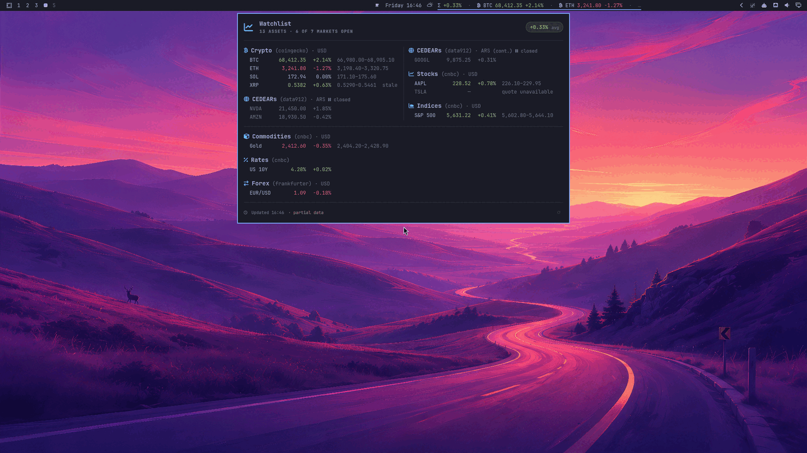 | 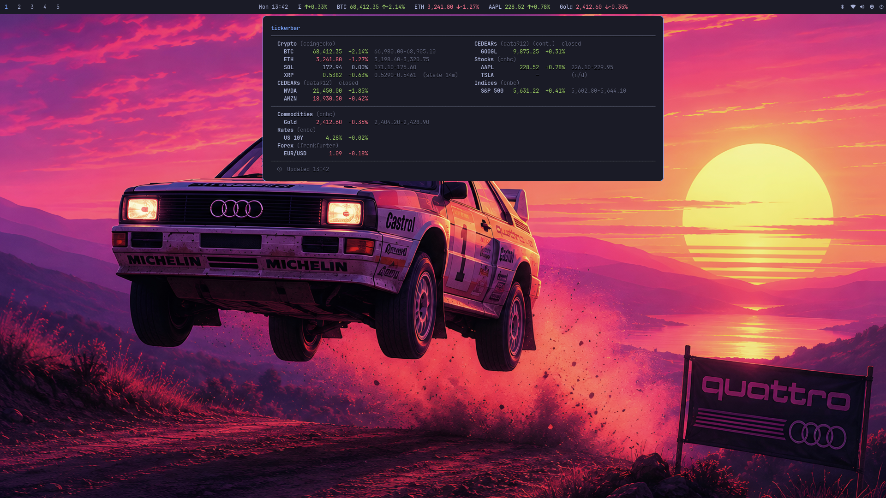 |

## Contents

- [Why tickerbar?](#why-tickerbar)
- [Screenshots](#screenshots)
- [Requirements](#requirements)
- [Installation](#installation)
- [Quick start](#quick-start)
- [Configuration](#configuration)
- [Waybar integration](#waybar-integration)
- [Theming](#theming)
- [Tooltip font](#tooltip-font)
- [Omarchy shell plugin](#omarchy-shell-plugin)
- [Structured JSON output](#structured-json-output)
- [Troubleshooting](#troubleshooting)
- [Development](#development)
- [Related](#related)

## Why tickerbar?

- **Many markets, one widget, no API key.** Crypto comes from CoinGecko. Stocks, indices, commodities and Treasury yields come from CNBC. Forex comes from Frankfurter. Watch BTC, NVDA, the S&P 500, gold, the US 10Y and EUR/USD together.
- **It never breaks your bar.** A dead API, a rate limit, a bad response or a broken config file all give valid JSON and exit code 0. One broken provider does not blank the others.
- **A table worth opening.** Rows align in columns and group by asset class. Long watchlists wrap into side-by-side columns and into stacked bands below. The core computes that layout one time, so both frontends draw the same shape.
- **Your theme, everywhere.** Colors come from the active Omarchy theme, or from a pywal cache, or from a built-in palette. The core publishes the palette that it resolved, so the bar, the tooltip and the panel paint the same number the same color.
- **It knows market hours.** tickerbar does not poll a closed market. Closed groups show a pause mark. Only crypto runs every day.
- **The Argentine market too.** data912 gives BYMA prices with no key: the blue dollar and the MEP dollar, plus local stocks, bonds, CEDEARs and corporate bonds in pesos.

## Screenshots

| Waybar bar and tooltip | Omarchy bar strip |
|:---:|:---:|
| 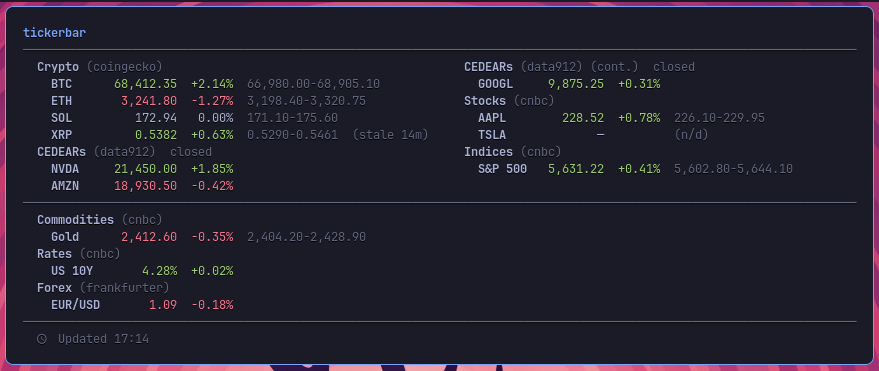 | 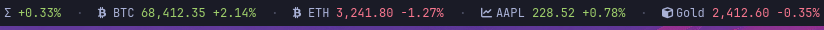 |

A long watchlist wraps into side-by-side columns and into bands below:

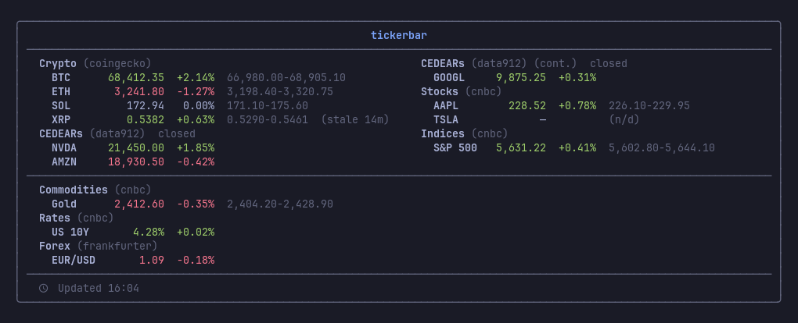

## Requirements

- [Waybar](https://github.com/Alexays/Waybar), or the [Omarchy](https://omarchy.org) shell for the native widget
- A **monospace** [Nerd Font](https://www.nerdfonts.com/) for the glyphs and for the tooltip's columns. Set `icons = "ascii"` if you do not have one. Refer to [Tooltip font](#tooltip-font).

## Installation

### Arch Linux (AUR)

```bash
yay -S tickerbar
```

### From source

```bash
git clone https://github.com/mryll/tickerbar.git
cd tickerbar
make install PREFIX=~/.local
```

To install for all users, run `sudo make install`. To remove tickerbar, use the same command with `uninstall`:

```bash
make uninstall PREFIX=~/.local
```

<p align="center">
  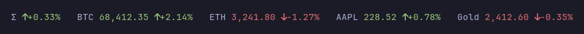
</p>

<p align="center">
  <em>Move the pointer onto the strip to get the full table:</em><br><br>
  
</p>

## Quick start

```bash
mkdir -p ~/.config/tickerbar
tickerbar --preset starter > ~/.config/tickerbar/config.toml
tickerbar
```

Run `tickerbar --help` for the full reference: the usage line, every flag, and the format placeholders.

The last command prints one line of Waybar JSON. The `starter` preset is a balanced set across markets: crypto, one megacap stock, one index, gold, one Treasury yield and one forex pair.

To see the other presets:

```bash
tickerbar --list-presets       # starter, crypto-top, megacap, indices-global, fx-majors, commodities, rates
tickerbar --preset crypto-top >> ~/.config/tickerbar/config.toml
```

## Configuration

tickerbar reads `~/.config/tickerbar/config.toml`. The repository has a full example:

```bash
cp config.example.toml ~/.config/tickerbar/config.toml
```

### Display

```toml
[display]
mode = "fixed"          # "fixed" | "rotate"
rotate_interval = 5     # seconds per asset (rotate mode only)
max_on_bar = 3          # assets shown on the bar (fixed mode)
icons = "nerd"          # "nerd" | "emoji" | "ascii"
bar_format = "{glyph} {label} {price} {arrow}{change_pct}"
summary_format = ""     # e.g. "Σ {avg_arrow}{avg_change}"
bar = []                # e.g. ["BTC", "ETH", "Gold"]
bar_layout = "{summary}   {bar}"
tooltip_rows_per_column = 0
tooltip_max_columns = 0
tooltip_range = false
# The family the tooltip is pinned to — a Pango family list, tried in order.
# It must be monospace. Refer to "Tooltip font".
tooltip_font = "JetBrainsMono Nerd Font Mono, JetBrainsMono Nerd Font, monospace"
```

| Key | Default | What it does |
|---|---|---|
| `mode` | `fixed` | `fixed` shows the first `max_on_bar` assets. `rotate` shows one asset at a time. |
| `rotate_interval` | `5` | Seconds per asset in `rotate` mode. |
| `max_on_bar` | `3` | How many assets the bar shows in `fixed` mode. |
| `icons` | `nerd` | Icon set for the bar: `nerd`, `emoji` or `ascii`. |
| `bar_format` | see above | Bar template. Tokens: `{label}` `{price}` `{change_pct}` `{arrow}` `{glyph}`. |
| `summary_format` | `""` | Optional average block. Tokens: `{avg_change}` `{avg_arrow}`. An empty value turns it off. |
| `bar` | `[]` | Labels to show on the bar, in this order. An empty list means all assets. The table does not change. |
| `bar_layout` | `{summary}   {bar}` | Where the two blocks go. An empty block drops its own separators. |
| `tooltip_rows_per_column` | `0` | Start a new column after N lines. `0` means one column. |
| `tooltip_max_columns` | `0` | The most columns side by side. Extra columns move to a band below. `0` means no limit. |
| `tooltip_range` | `false` | Add the low-high range of the day to each row. |
| `tooltip_font` | `JetBrainsMono Nerd Font Mono, JetBrainsMono Nerd Font, monospace` | The family the tooltip is pinned to. It must be monospace — refer to [Tooltip font](#tooltip-font). |
| `frame`, `frame_font` | — | **DEPRECATED**, still accepted. `frame` drew a bordered card and is now a no-op; `frame_font` is an alias for `tooltip_font`. |

> [!NOTE]
> Format strings are Pango markup. Write a literal `&`, `<` or `>` as `&amp;`, `&lt;` or `&gt;`.
>
> `summary_format` gives the equal-weight mean of the daily change of each asset. Assets with no daily change stay out of it. A mean across different markets is a mood, not a portfolio return.

### Assets

Each asset is one `[[asset]]` block with three parts:

```toml
[[asset]]
label = "BTC"           # the text on the bar and in the table — your choice
provider = "coingecko"  # where the price comes from
id = "bitcoin"          # the keys that provider needs
quote = "usd"
```

Find your asset class in the first column. That row gives you the `provider` and the keys it needs. Every provider works with **no API key**, except `finnhub`.

| To track | `provider` | Other keys | Accepted values |
|---|---|---|---|
| A stock | `cnbc` | `symbol` | A ticker: `AAPL`, `MSFT`. Outside the United States, see below. |
| A crypto coin | `coingecko` | `id`, `quote` | A CoinGecko coin id (`bitcoin`) and any vs_currency (`usd`, `eur`, `ars`). |
| A stock index | `index` | `symbol` | `sp500`, `nasdaq`, `dow`, `vix`, `dax`, `ftse`, `nikkei`, `hangseng`, or a raw symbol (`.SPX`). |
| A commodity | `commodity` | `symbol` | `gold`, `silver`, `wti`, `brent`, `natgas`, `copper`, `platinum`, `palladium`, or a raw symbol (`@GC.1`). |
| A treasury yield | `rate` | `symbol` | `us10y`, `us2y`, `us5y`, `us30y`. Shown as a percent. |
| A currency pair | `frankfurter` | `base`, `quote` | Two currency codes: `base = "eur"`, `quote = "usd"`. Daily reference rates. |
| The Argentine dollar | `dolarapi` | `casa`, `side` | `casa = "blue"`, `casa = "mep"`, and the other houses. Prices in ARS. |
| The Argentine market (BYMA) | `data912` | `panel`, `symbol` | `panel` is `acciones`, `bonos`, `cedears` or `corp`. Prices in ARS, about 2 hours late. |
| A stock, from a documented source | `finnhub` | `symbol` | A ticker. Needs a free key (see below). |

Three examples:

```toml
[[asset]]
label = "AAPL"
provider = "cnbc"
symbol = "AAPL"

[[asset]]
label = "S&P 500"
provider = "index"
symbol = "sp500"

[[asset]]
label = "EUR/USD"
provider = "frankfurter"
base = "eur"
quote = "usd"
```

#### Stocks outside the United States

`cnbc` takes a plain ticker for a listing in the United States. For a different exchange, add the country code to the ticker. The currency comes from the feed, so each stock keeps the currency of its own exchange.

| Exchange | `symbol` | Currency |
|---|---|---|
| United States | `AAPL` | USD |
| London | `VOD-GB` | GBP |
| Amsterdam | `ASML-NL` | EUR |
| Paris | `AIR-FR` | EUR |
| Toronto | `SHOP-CA` | CAD |

Not every market answers. Tokyo (`-JP`) and Buenos Aires (`-AR`) give no data. The format is not documented by the source, so test a symbol before you trust it:

```bash
tickerbar --output json | jq '.groups[].rows[] | {label, price, state}'
```

A symbol that works shows `"state": "fresh"` and a price. A symbol that does not shows `"state": "missing"`.

> [!IMPORTANT]
> Market hours apply **one calendar per provider**, not per asset. All `cnbc` stocks use the hours of the United States. If you track a stock from a different country, turn the gate off for `cnbc` (see [Market hours](#market-hours)). If you do not, the group is marked closed at the wrong times.

> [!NOTE]
> Stocks and indices need **no key** through `cnbc`. That endpoint is public but not documented, so treat the prices as late and best effort. tickerbar is **not** a live trading feed.
>
> For a documented source with a free key, use `finnhub`:
>
> ```bash
> export FINNHUB_TOKEN=your_free_token   # from https://finnhub.io; sent as a header, never in a URL
> ```

### Market hours

tickerbar does not poll a market while it is closed. It serves the last close from the cache and marks the group as closed. The calendars know time zones and daylight saving time through `chrono-tz`.

| Market | Hours |
|---|---|
| Crypto | Every day, all day |
| BYMA (`data912`) | Monday to Friday, 10:30 to 17:00 ART |
| US stocks (`cnbc`, `finnhub`) | Monday to Friday, 09:30 to 16:00 ET |
| Forex (`frankfurter`) | Monday to Friday |
| Commodities, indices, rates | Always polled, no closed mark |

```toml
[market_hours]
enabled = true                 # master switch (default)

[market_hours.providers.cnbc]
enabled = false                # disable gating for one provider (e.g. a non-US stock via cnbc)
```

> [!NOTE]
> The stock providers assume **US** hours. Turn their gate off if you track a stock from another country through them. The calendars do not know the holidays of an exchange.

## Waybar integration

Add a custom module to `~/.config/waybar/config`:

```jsonc
"custom/tickerbar": {
  "exec": "tickerbar",
  "return-type": "json",
  "interval": 60,
  "tooltip": true,
  "signal": 8
}
```

Then put `"custom/tickerbar"` in one of your `modules-*` arrays. To get new data at any time:

```bash
pkill -RTMIN+8 waybar
```

tickerbar sets CSS classes for the lifecycle (`ok`, `partial`, `stale`, `error`) and for the direction (`up`, `down`, `flat`, `mixed`). Use them in `~/.config/waybar/style.css`:

```css
#custom-tickerbar.up    { color: #98c379; }
#custom-tickerbar.down  { color: #e06c75; }
#custom-tickerbar.stale { opacity: 0.6; }
#custom-tickerbar.error { color: #e06c75; }
```

### Monochrome mode

For a quiet bar, turn the colors off everywhere, or on one surface only:

| Command | Bar text | Tooltip |
|---|---|---|
| *(no flag)* | color | color |
| `--no-color` / `--no-color=all` | plain | plain |
| `--no-color=bar` | plain | color |
| `--no-color=tooltip` | color | plain |

Plain means no Pango color markup on that surface. Everything with a structure stays. That is the glyphs, the direction arrow, the box, the bold labels, the dim marks on closed and stale rows, and the column alignment. Column widths do not move, because the core measures them without the markup tags.

tickerbar also obeys the `NO_COLOR` environment variable, as [no-color.org](https://no-color.org) describes. Any value that is not empty acts like `--no-color=all`. An explicit flag wins over the variable, so `NO_COLOR=1 tickerbar --no-color=bar` keeps the color in the tooltip. The flag is the more exact instruction.

The CSS classes stay the same in every mode. Monochrome plus your own classes is therefore the **style it yourself** path: remove the built-in colors and drive the module from your stylesheet.

<p align="center">
  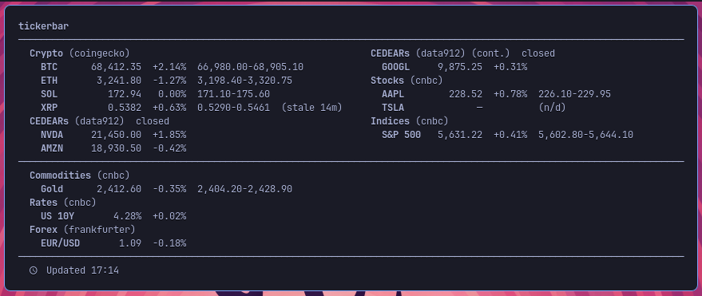
</p>

## Theming

Colors come from the first source in this list that exists:

| # | Source | Path |
|---|---|---|
| 1 | Omarchy theme | `$XDG_STATE_HOME/omarchy/current/theme/colors.toml` (default `~/.local/state/…`) |
| 2 | Omarchy theme, old location | `~/.config/omarchy/current/theme/colors.toml` |
| 3 | pywal cache | `$XDG_CACHE_HOME/wal/colors.json` (default `~/.cache/…`) |
| 4 | Built-in One Dark palette | — |

An Omarchy theme gives the keys `accent`, `foreground`, `background`, `red`, `green`, `yellow` and `orange`. Older themes that give only the terminal palette (`color1`, `color2`, `color3`) still work.

One path covers three tools. The first pywal is archived, but [pywal16](https://github.com/eylles/pywal16) writes the same file, and [wallust](https://codeberg.org/explosion-mental/wallust) has a target that is compatible with pywal. pywal has no orange slot, so tickerbar makes orange from the middle point between yellow and red.

If a source has no value for a key, that key keeps its built-in default. Every value must be correct hex. A partial theme or a bad value can therefore not turn theming off.

| Flexoki Light | Rosé Pine | Hackerman |
|:---:|:---:|:---:|
| 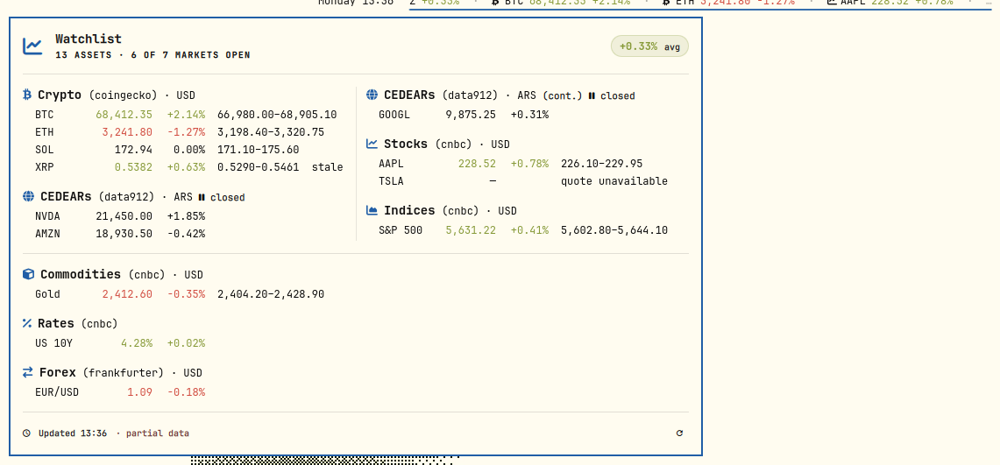 | 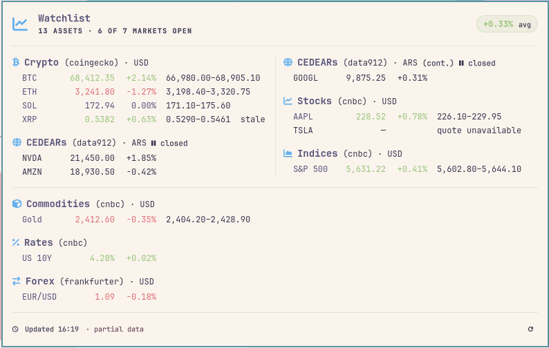 | 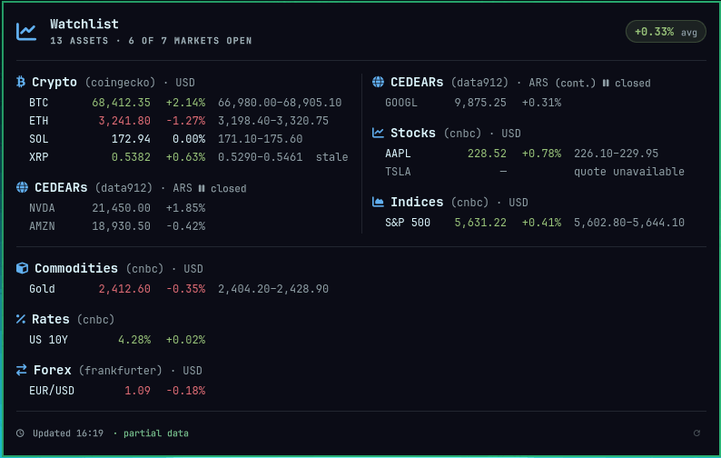 |

| Ristretto | Nord | Kanagawa |
|:---:|:---:|:---:|
| 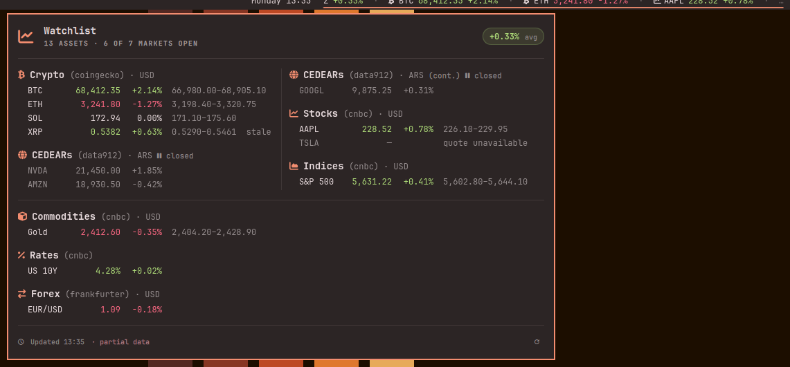 | 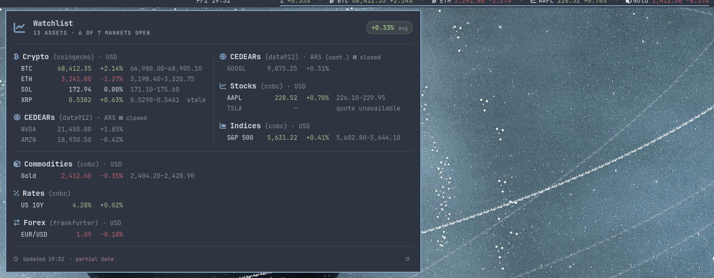 | 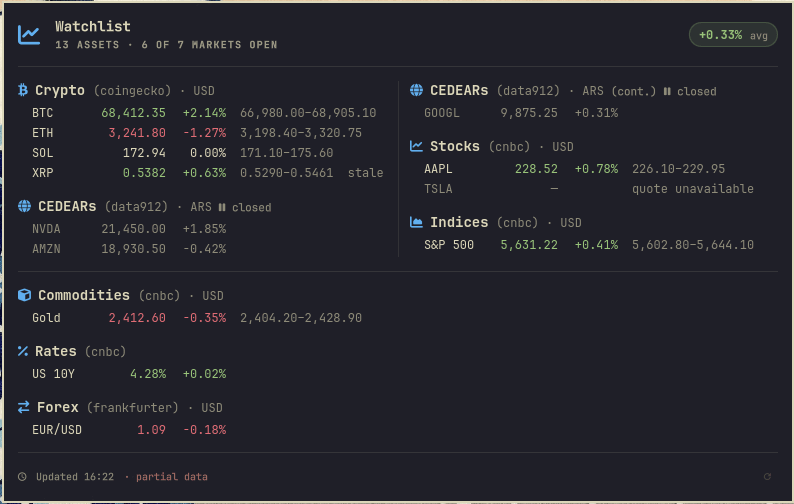 |

The Waybar tooltip follows the same themes:

| Flexoki Light | Rosé Pine | Hackerman |
|:---:|:---:|:---:|
| 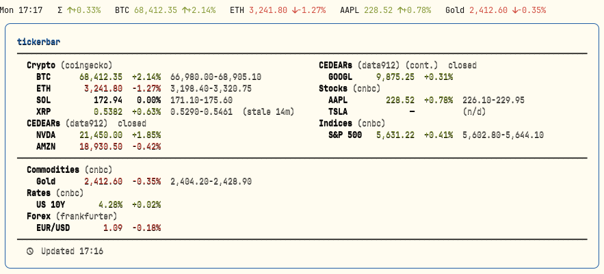 | 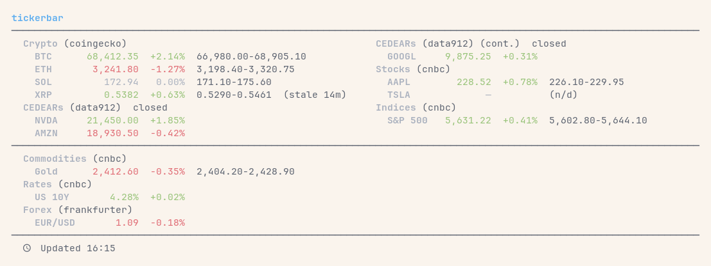 | 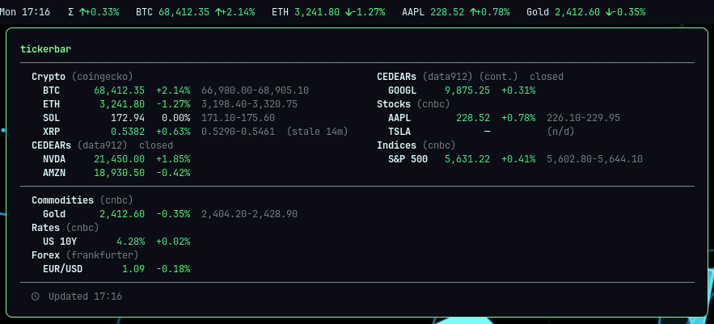 |

| Ristretto | Nord | Kanagawa |
|:---:|:---:|:---:|
| 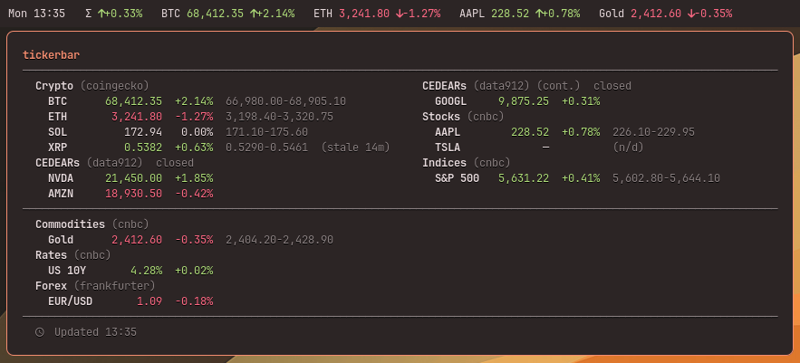 | 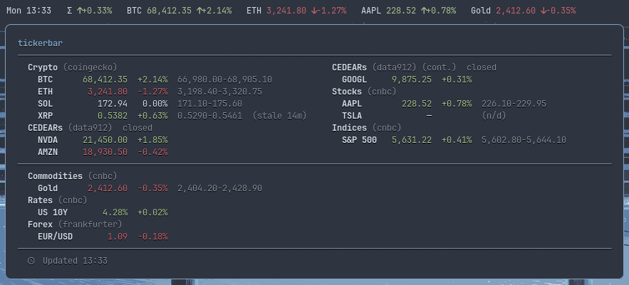 | 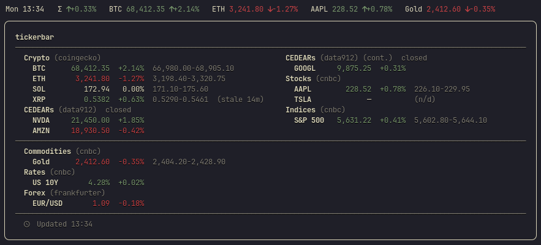 |

> [!NOTE]
> **If you upgrade, your colors will change.** Older versions looked only in `~/.config/…` and needed a `color1` key. Current Omarchy keeps the theme in the state directory and uses named keys. The older versions therefore found nothing and painted the built-in palette without a message. Colors now follow your real theme. This is the correction, not a fault.
>
> **The Omarchy bar strip has more color than before.** It used a weak tint of its own. It now paints the color that the core publishes, which is the color the Waybar bar already used.

## Tooltip font

The tooltip is pinned to a monospace font. That is not decoration: this tooltip is a **table** — without one advance per character the columns stop lining up, and its rules are box-drawing characters, and in a proportional font one of those is nearly twice as wide as a letter. The tooltip then sizes itself to the rules, and a dead margin opens to the right of the text. Waybar draws the tooltip in a GTK window that ignores `font-family` from your CSS, so the markup is the only place this can be said.

The default is a **list** of families, tried in order:

```toml
[display]
tooltip_font = "JetBrainsMono Nerd Font Mono, JetBrainsMono Nerd Font, monospace"
```

Pango falls through to the next name when one is not installed. This matters: the Arch package `ttf-jetbrains-mono-nerd` does **not** ship the `…Mono` family, so pinning that one name alone used to fall back to your system's proportional font without saying so.

> [!NOTE]
> **`frame` and `frame_font` are deprecated.** `frame` drew the tooltip as a bordered card. It is still accepted, so an existing config keeps loading, but it now does nothing; `frame_font` is an alias for `tooltip_font`.
>
> The box was a second way of drawing the same content — more code, more documentation, more screenshots — and it only lined up when the pinned font was a complete Mono Nerd Font. Pinning the font on the one remaining tooltip gives the alignment without the box.

## Omarchy shell plugin

tickerbar also has a native widget for the [Omarchy shell](https://github.com/basecamp/omarchy), in the `omarchy/` directory.

The bar shows your list from `display.bar` as a compact strip with tinted prices, each one led by its asset-class mark. A click opens a themed panel. The panel starts with a header that gives the asset count and the number of markets that are open. Below the header, the full watchlist is a real table, grouped by asset class. The header also carries the watchlist average, which the panel shows by default. Use `summaryMode` to control it. A value of `hide` removes the average from the bar and from the panel. Closed markets are dim, and a footer gives the time of the last update. A middle click gets new data. The footer of the panel ends with a refresh control (󰑐), next to the time of the last update. The control stays disabled while a fetch runs.

<p align="center">
  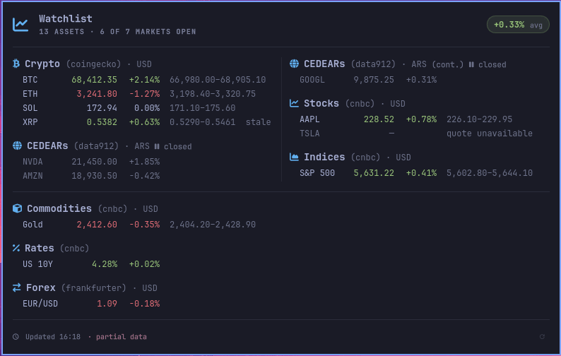
</p>

The panel never scrolls. Long watchlists wrap into side-by-side columns and into bands below. The core computes the packing one time, in the same code that lays out the Waybar tooltip. It sends the plan inside the structured JSON (`layout.bands`). The panel only draws it.

The horizontal rule in the screenshot above is a band break. The columns wrap when their number goes above `tooltip_max_columns`, and each band of columns gets a rule above it. The screenshot uses `tooltip_max_columns = 2`, so the three columns of that watchlist become a band of two and a band of one. Raise the limit and the rule goes away.

Both frontends obey `tooltip_rows_per_column` and `tooltip_max_columns`. There is one honest difference at `tooltip_rows_per_column = 0`. The Waybar tooltip draws one column. The panel measures how many lines and columns its screen can hold, then sends the measurements as `--rows-per-column` and `--max-columns`. The core applies them only where the config left the value at 0, and it uses `--max-columns` only to make the limit smaller. A value above 0 in the config pins both frontends to the same fixed layout.

The plugin also answers the shell's IPC, so a keybind or a script can drive it without the mouse:

```bash
qs ipc call mryll.tickerbar toggle    # open or close the panel
qs ipc call mryll.tickerbar refresh   # fetch now, without opening anything
```

### Install the plugin

`make install-omarchy` makes a symbolic link from the repository root to `~/.config/omarchy/plugins/mryll.tickerbar`. The manifest is in that root and points to `omarchy/`.

```bash
make install          # the plugin runs the tickerbar binary from PATH
make install-omarchy
```

Then add the widget to a bar section in `~/.config/omarchy/shell.json`:

```json
{ "id": "mryll.tickerbar" }
```

To remove the plugin, run `make uninstall-omarchy`. This removes only the symbolic link.

> [!IMPORTANT]
> The shell does not detect file changes through a symbolic link. After you edit a plugin file, run `omarchy restart shell`. A `rescanPlugins` command finds new plugins, but it does not compile the QML again.

### Plugin settings

Change these settings in the settings window of the shell, or write them in the `shell.json` entry:

| Setting | Type | Default | Description |
|---|---|---|---|
| `refreshIntervalSec` | integer | `60` | Seconds between updates (5 to 3600). |
| `configPath` | string | `""` | Another config file. An empty value means `~/.config/tickerbar/config.toml`. |
| `summaryMode` | enum | `follow` | The watchlist average on the bar. `follow` obeys `summary_format`. `show` and `hide` force it. |
| `colorMode` | enum | `full` | Direction tint: `full`, `none`, `bar-only` (color on the strip only), `panel-only` (the opposite). This is equal to `--no-color` in the CLI. |

<p align="center">
  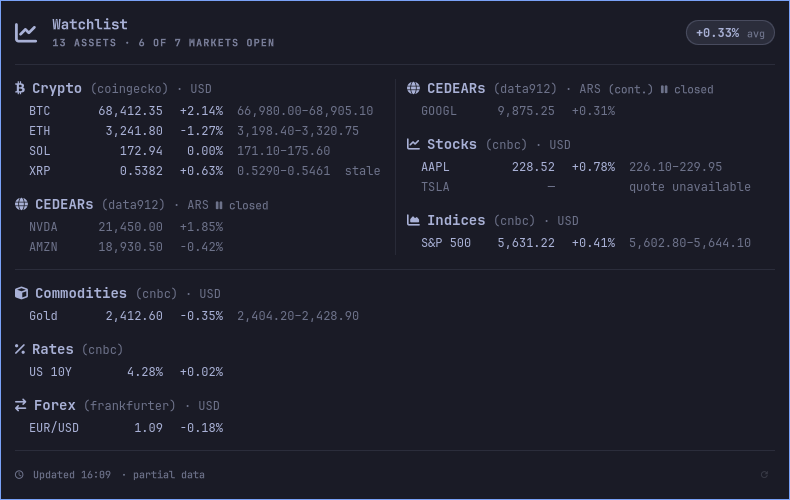
</p>

## Structured JSON output

`tickerbar --output json` prints one JSON object with the raw data and no markup. Numbers stay numbers. Any frontend can read it, and the Omarchy widget uses it.

```bash
tickerbar --output json | jq .
```

The document has `schema_version: 1` and these top-level keys:

| Key | What it holds |
|---|---|
| `state` | `ok`, `partial`, `stale` or `error`. |
| `error` | `null`, or an object with a `message`. |
| `fetched_at` | The time of the run, in ISO-8601. |
| `bar` | The rows for the bar, already selected and in order. |
| `avg_change_pct` | The equal-weight mean change, or `null`. |
| `summary_configured` | Whether the config file sets a `summary_format`. |
| `layout` | The packing plan: `rows_per_column`, `max_columns` and `bands`. |
| `groups` | The rows by asset class, each with a `label`, a `glyph` and its sources. |
| `palette` | The colors that the core resolved. |

The `palette` holds `up`, `down`, `flat`, `text`, `dim`, `accent` and `error`. The first three are the direction colors that the core paints the Waybar tooltip with. A frontend applies them and does not make a tint of its own. The bar, the tooltip and the panel therefore give the same number the same color. One change to the theme chain moves all of them together.

> [!NOTE]
> `--no-color` never touches this document. It is a choice about the Pango surfaces only, so `palette` always holds the real colors. Like the Waybar mode, this mode always exits with code 0 and valid JSON.

A row with no change for the day shows a percent with no sign, for example ` 0.00%`. A sign would say that the price moved. The width of the column stays the same, so the numbers keep their alignment. A very small move that rounds to `0.00` keeps its real sign, because the direction comes from the data and not from the printed text.

## Troubleshooting

| Symptom | Cause and correction |
|---|---|
| The module shows `?` and an error tooltip | The config file is bad, or a necessary key is absent. The tooltip gives the message. |
| The Omarchy widget says the binary is absent | `tickerbar` is not on `PATH`. Run `make install PREFIX=~/.local`, or install the AUR package. |
| A stock or an index shows `n/d` | The market is closed, or the provider does not know the symbol. Test it with `tickerbar --output json` (see [Stocks outside the United States](#stocks-outside-the-united-states)). |
| The columns do not align | The pinned font is not monospace. Name a monospace family with `tooltip_font`, or leave the default. |
| The colors do not follow my theme | Install the current version. Older versions read a path that current Omarchy no longer writes. |
| An edit to the plugin does nothing | Run `omarchy restart shell`. |
| The bar is too wide | Make `max_on_bar` smaller, or put only the labels that you want in `bar`. |

## Development

```bash
cargo test                          # unit + never-crash tests (offline)
cargo test --features integration   # real-API smoke tests (network; set FINNHUB_TOKEN for the finnhub one)
cargo clippy --all-targets -- -D warnings
cargo fmt
```

The `screenshots/demo/demo-data` script gives a fixed demo watchlist in both output formats. Put its directory first on `PATH` to take screenshots with no live data:

```bash
PATH="$PWD/screenshots/demo:$PATH" waybar
```

## Related

- [claudebar](https://github.com/mryll/claudebar) — Claude AI plan usage
- [codexbar](https://github.com/mryll/codexbar) — OpenAI Codex subscription usage
- [logibar](https://github.com/mryll/logibar) — the battery of Logitech devices
- [meteobar](https://github.com/mryll/meteobar) — the weather, from Open-Meteo
- [printbar](https://github.com/mryll/printbar) — any printer: supplies, trays and queue
- [Omarchy](https://github.com/basecamp/omarchy) — the Linux setup for these widgets
- [Waybar](https://github.com/Alexays/Waybar) — the status bar for Wayland
